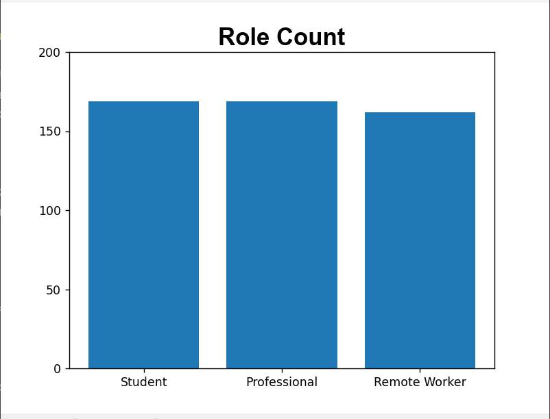
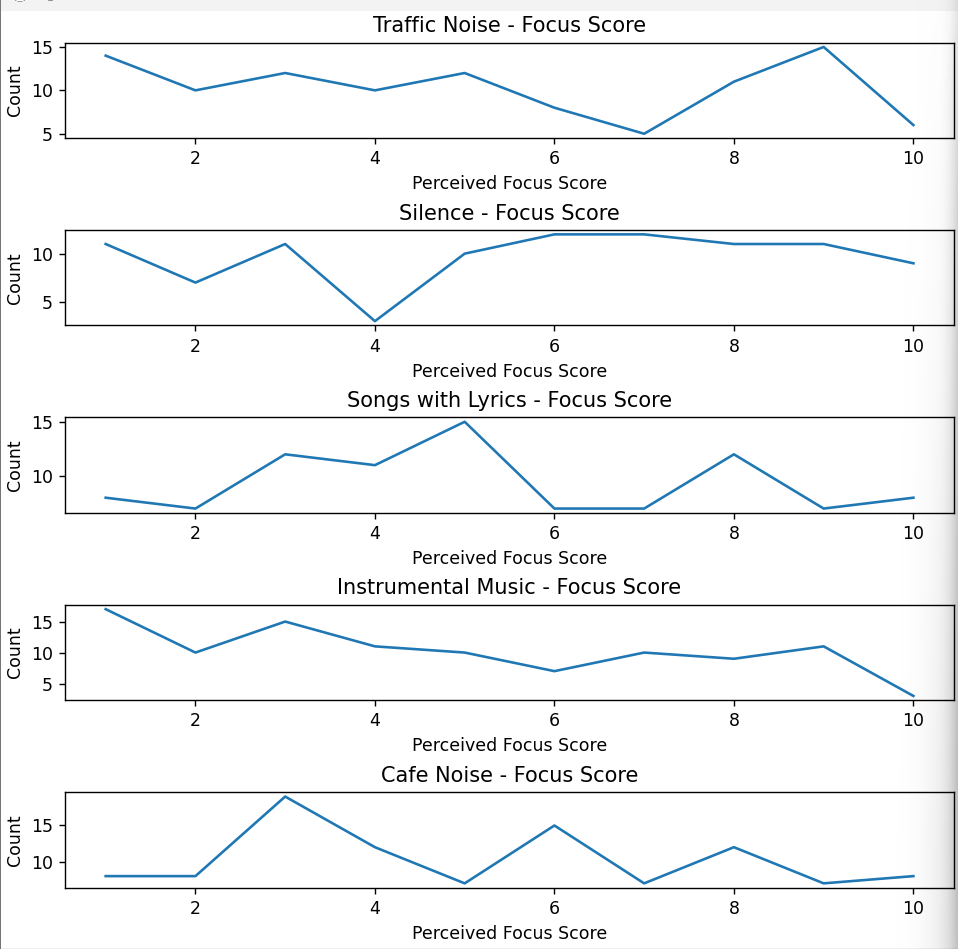

A simple project of data pipeline and using python, which practices basic operation including extract, claen, transform, validate, load, plot

The python libraries used in the project include Numpy, Pandas, Matplotlib

csx data source: https://www.kaggle.com/datasets/prince7489/background-noise-and-focus-dataset

solution images:

